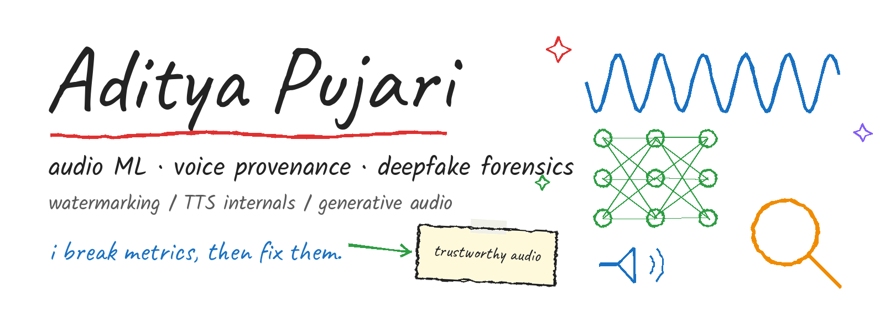
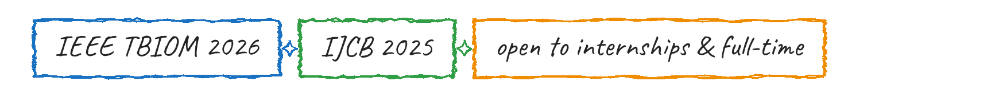
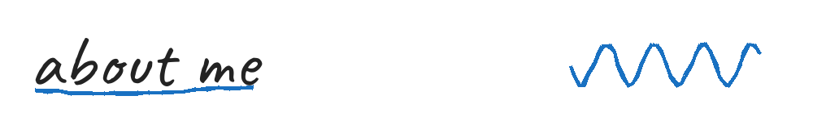
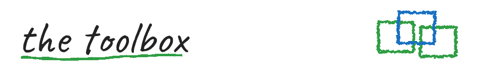
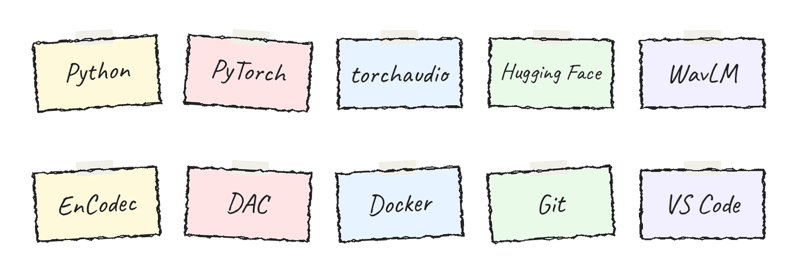
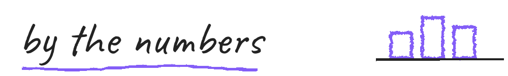
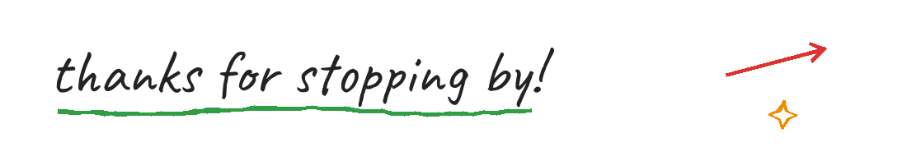

i work on **trustworthy audio** — watermarking voices, tracing synthetic speech, and taking models apart from the inside (TTS internals, neural codecs). if an audio metric can be broken, i want to be the one who breaks it... then fixes it.

 **AudioAuth** — dual-watermarking framework: frequency-partitioned model + data watermarks for audio integrity and source attribution (IEEE TBIOM 2026)

 **WaveVerify** — FiLM-generator + MoE-detector watermarking; zero BER under common distortions; beats AudioSeal and WavMark (IJCB 2025)

 **sourcetrace** — codec-residual open-set source tracing of audio deepfakes (EnCodec residual + frozen WavLM-Large; FPR95 1.14% vs published 3.36%)

 **spanmark** — two-route segment localization of partially spoofed speech; cross-corpus SOTA on LlamaPartialSpoof (29.0 EER vs 35.5 baseline)

 **wavepainter** — multimodal LLM-guided diffusion for text-based speech editing; substitution WER 3.48 vs prior best 4.41

 **cond-ID** — speaker unlearning in zero-shot TTS via conditioning-space identity redirection (XTTS-v2, Tortoise-TTS, IndexTTS-1.5)

 **HiggsAudiov2TokenizerUnofficial** — full PyTorch training pipeline for the Higgs Audio V2 tokenizer (HuBERT semantics + DAC + 8-layer RVQ, 960x downsampling)

  

*pinned to the board — updates live*

