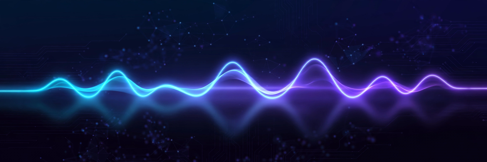

<h1 align="center">Aditya Pujari</h1>

  

  PhD student, University of North Texas · advisor: Ajita Rattani 
  I work on <b>trust and safety for speech and audio</b> — watermarking, deepfake forensics, and voice provenance.

  
  
  

## What I build

- **AudioAuth** — dual-watermarking framework: frequency-partitioned model + data watermarks for audio integrity and source attribution (IEEE TBIOM 2026)
- **WaveVerify** — FiLM-generator + MoE-detector watermarking; zero BER under common distortions; beats AudioSeal and WavMark (IJCB 2025)
- **sourcetrace** — codec-residual open-set source tracing of audio deepfakes (EnCodec residual + frozen WavLM-Large; FPR95 1.14% vs published 3.36%)
- **spanmark** — two-route segment localization of partially spoofed speech; cross-corpus SOTA on LlamaPartialSpoof (29.0 EER vs 35.5 baseline)
- **wavepainter** — multimodal LLM-guided diffusion for text-based speech editing; substitution WER 3.48 vs prior best 4.41
- **cond-ID** — speaker unlearning in zero-shot TTS via conditioning-space identity redirection (XTTS-v2, Tortoise-TTS, IndexTTS-1.5)
- **HiggsAudiov2TokenizerUnofficial** — full PyTorch training pipeline for the Higgs Audio V2 tokenizer (HuBERT semantics + DAC + 8-layer RVQ, 960x downsampling)

## Stack

  

WavLM · XLS-R · ECAPA-TDNN · Wav2Vec2 · EnCodec · DAC · RVQ · torchaudio · Hugging Face · GAN training · sha256-pinned reproducible evals

## Stats

  

